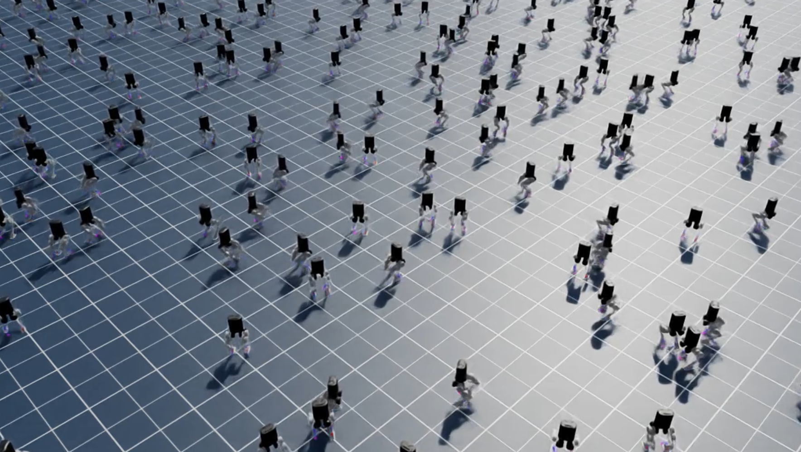

# Bipedal-PyMPC
This project is a batched MPC controller targetted for learning and model-based hybrid control research. 

</img>

## Installation 
We offer easy pip install. 
```bash
pip install .
```

### Configure CusADi function
To run CusADi, you need to compile your casadi code as .so file. \
We assume your base casadi function file is saved in `biped_pympc/cusadi/src/casadi_functions`. 
```bash
# pip install -e biped_pympc/cusadi
# compile casadi as cusadi .so file
python3 cusadi/run_codegen.py --fn {cusadi_function}
cp cusadi/build/{cusadi_function}.so cusadi/src/cusadi_functions/{cusadi_function}.so
```

## Simulation example 
To debug codebase, you may use Genesis or IsaacLab. \
As multi-platform is supported, we use genesis in this example. 

Install
```bash
git clone git@github.com:jnskkmhr/genesis_biped.git
# check its README
```

Run 
```bash 
python3 run_linux.py # ubuntu
python3 run.py # mac os
```
You should see GUI like the following. 
</image>

## WIP List

### Initial code base implementation
- [x] Implement biped.py
- [x] Implement robot_data.py
- [x] Implement gait_generator.py
- [x] Implement state_estimator.py
- [x] Implement swing_leg_trajectory.py
- [x] Implement qp solver
- [x] Functional SRBD MPC
- [x] Implement swing_leg_controller.py
- [x] Implement leg_controller.py
- [x] Implement bipedal_controller.py (equivalent of FSMWalking.cpp)
- [x] Check code in Genesis
- [x] Check code in Isaac

### Interface and functionalities
- [ ] Add IsaacLab example
- [ ] Align swing leg trajectory with C++ implementation 
- [ ] Add RL-MPC interface
- [ ] Add CusADi solver
- [ ] Create ROS2 wrapper