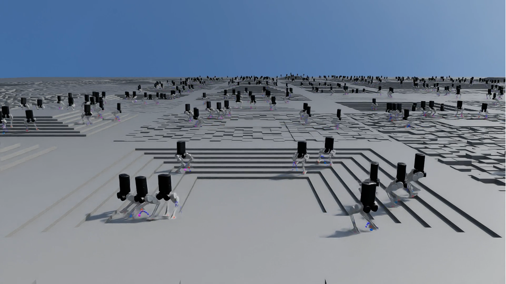
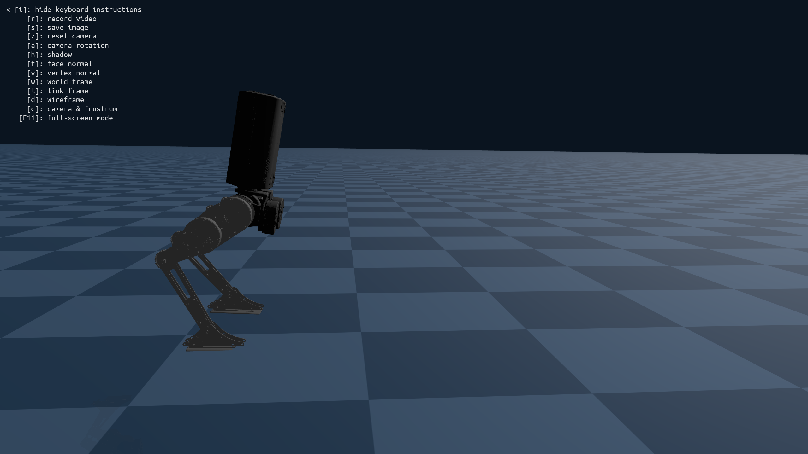

# Bipedal-PyMPC
This project presents a **batched MPC controller** designed for learning and model-based hybrid combined approach.
We open-source a batched QP solver implemented in **CusADi**, along with kinematics and dynamics code written purely in PyTorch.

</img>

## Installation 
```bash
pip install -e .
```

## Code generation 

### Generate CasADi function 
```bash 
# generate functions that form QP matrices and solve this QP problem.
python3 -m biped_pympc.casadi.srbd_constraints
python3 -m biped_pympc.casadi.generate_solver_function
```
This generate casadi function file ready to be compiled as cuda kernel. 

### Generate CusADi function
To run CusADi, you need to compile your casadi code as .so file. \
We assume your base casadi function files are saved in `biped_pympc/cusadi/src/casadi_functions`. 
```bash
# compile casadi as cusadi .so file

# compile dynamics code
python3 cusadi/run_codegen.py --fn qp_former
cp cusadi/build/qp_former.so cusadi/src/cusadi_functions/qp_former.so

# compile solver code
python3 cusadi/run_codegen.py --fn sparse_pdipm_multiple_iterations
cp cusadi/build/sparse_pdipm_multiple_iterations.so cusadi/src/cusadi_functions/sparse_pdipm_multiple_iterations.so
```

<!-- ## Simulation example 
To debug codebase, you may use Genesis or IsaacLab. \
As multi-platform is supported, we use genesis in this example. 

Install
```bash
git clone git@github.com:jnskkmhr/genesis_biped.git
# check its README
```

Run 
```bash 
python3 run_linux.py # ubuntu
python3 run.py # mac os
```
You should see GUI like the following. 
</image> -->

## WIP List

### Initial code base implementation
- [x] Implement biped.py
- [x] Implement robot_data.py
- [x] Implement gait_generator.py
- [x] Implement state_estimator.py
- [x] Implement swing_leg_trajectory.py
- [x] Implement qp solver
- [x] Functional SRBD MPC
- [x] Implement swing_leg_controller.py
- [x] Implement leg_controller.py
- [x] Implement bipedal_controller.py (equivalent of FSMWalking.cpp)
- [x] Check code in Genesis
- [x] Check code in Isaac

### Interface and functionalities
- [x] Add IsaacLab example
- [x] Add RL-MPC interface
- [x] Add CusADi solver
- [ ] Create ROS2 wrapper

### Update 
- [ ] Create QP solver in warp sparse class. 

## Limitation
The current codebase suffers from long compilation times because CusADi compiles the generated SX instructions one by one.
This forced us to limit full Newton iterations to a maximum of 5 within a single QP solve.
Even so, compiling 5 Newton iterations takes around 3 hours, which is a significant bottleneck.
Future work involves replacing the CusADi-based solver with one written purely in cuSparse, CuDSS or Warp.


## Acknowledgement 
We thank Se Hwan Jeon for his support in setting up CusADi and open-sourcing the code. 